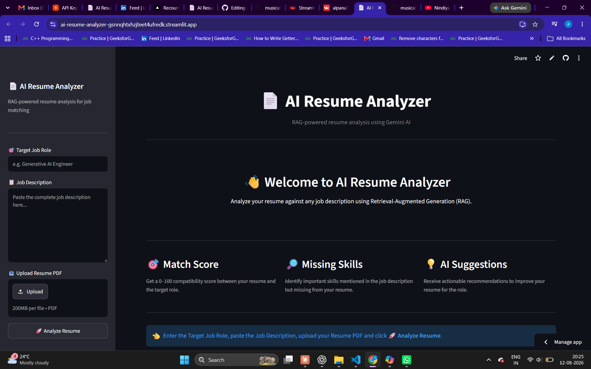

# 📄 AI Resume Analyzer

## 🖼️ Preview




## 🚀 Live Demo

👉 [Try it live](https://ai-resume-analyzer-gsnnqhtxhzjteet4ufredk.streamlit.app/)
## 🎯 What it does

Upload your resume PDF and enter a target job role — the system analyzes your resume using semantic retrieval and Gemini AI, then returns:

- 📊 **AI Match Score** (0–100)
- ✅ **Strengths** — what you already have
- ❌ **Missing Skills** — what the job needs but your resume lacks
- ⚠️ **Weaknesses** — areas that need improvement
- 💡 **Suggestions** — actionable steps to improve your resume

## 🧠 Tech Stack

| Technology             | Purpose                          |
|-------------------------|----------------------------------|
| Gemini AI               | LLM for resume analysis          |
| RAG Pipeline            | Retrieval-Augmented Generation   |
| FAISS                   | Vector similarity search         |
| Sentence Transformers   | Text embeddings (MiniLM)         |
| pdfplumber               | PDF text extraction              |
| Streamlit                | Web UI                           |
| Plotly                   | Gauge chart visualization        |
| Python                   | Core language                    |


## 🏗️ Project Structure

```
ai-resume-analyzer/
├── chatbot/
│   └── bot.py              # Gemini AI integration
├── services/
│   ├── resume_loader.py    # PDF text extraction
│   ├── text_splitter.py    # Chunk splitting
│   └── vector_store.py     # FAISS vector store
├── utils/
│   └── helpers.py          # JSON save utility
├── app.py                  # Streamlit UI
├── main.py                 # CLI version
└── requirements.txt
```

## ⚙️ How to run locally

**1. Clone the repo**
```bash
git clone https://github.com/Alpana176/ai-resume-analyzer.git
cd ai-resume-analyzer
```

**2. Create virtual environment**
```bash
python -m venv .venv

# Windows
.venv\Scripts\activate

# macOS/Linux
source .venv/bin/activate
```

**3. Install dependencies**
```bash
pip install -r requirements.txt
```

**4. Add your API key**

Create a `.env` file in the root folder:
```
GEMINI_API_KEY=your_gemini_api_key_here
```

**5. Run the app**
```bash
streamlit run app.py
```

## 🔑 Get Gemini API Key

Get your free API key at 👉 [Google AI Studio](https://aistudio.google.com/)

## 📌 Features

- ✅ RAG-based resume analysis
- ✅ AI-powered match scoring
- ✅ Skill gap detection
- ✅ Interactive gauge chart
- ✅ Clean dashboard UI
- ✅ JSON result saving
- ✅ Both Streamlit UI and CLI included

## 🙋‍♀️ Author

**Alpana Choubey**
[LinkedIn](https://www.linkedin.com/in/alpana-choubey-28152422a) • [GitHub](https://github.com/Alpana176)


**Alpana Choubey**  
[LinkedIn](https://www.linkedin.com/in/alpana-choubey-28152422a) • [GitHub](https://github.com/Alpana176)
